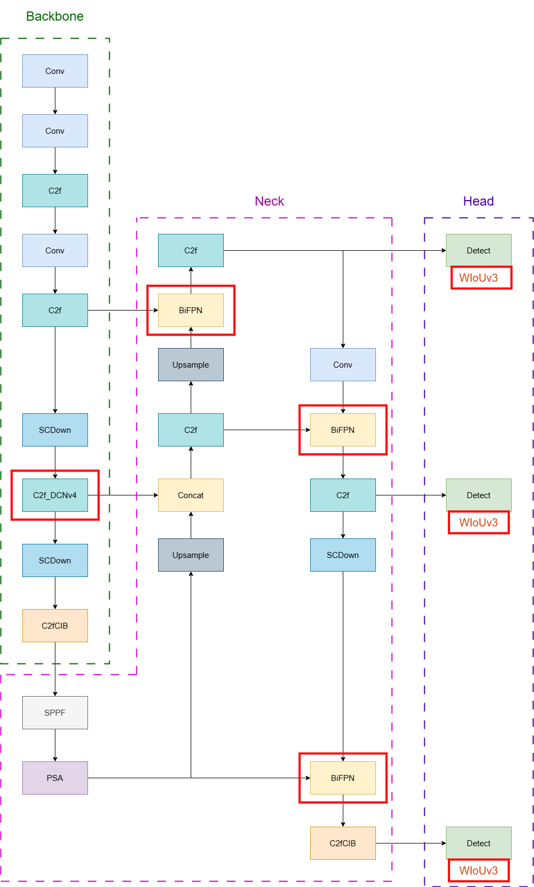

# EDGE-EFFICIENT DEFORMATIONAWAREMULTI-SCALE DETECTION FOR UNDERWATER TRASH DETECTION

This repository contains the implementation and experimental work for my thesis project, conducted at the **Asian Institute of Technology (AIT)**.

The project focuses on improving a lightweight YOLO-based object detection model for underwater trash and underwater object detection. The goal is to improve detection accuracy, robustness, and real-time inference performance while keeping the model suitable for edge deployment on resource-constrained devices such as ROVs or AUVs.

## Project Overview

Underwater trash detection is challenging because underwater images often contain:
- Low visibility
- Blur and turbidity
- Color distortion
- Uneven lighting
- Small or partially occluded objects
- Irregular and deformable object shapes

To address these challenges, this project modifies YOLOv10n using three main architectural improvements:

- **DCNv4**, to improve adaptability to irregular object shapes and geometric variations
- **BiFPN**, to strengthen multi-scale feature fusion for small and large object detection
- **WIoUv3**, to improve bounding box localization under noisy and ambiguous underwater conditions

The final model is evaluated not only on the TrashCan dataset, but also on three standard underwater object detection datasets: **RUOD**, **DUO**, and **UODD**.

## Research Objectives

The main objectives of this project are:

- To improve YOLOv10n for underwater trash detection
- To enhance small-object detection in cluttered underwater environments
- To improve robustness against underwater image distortions such as blur, lighting variation, and color shift
- To evaluate the trade-off between accuracy, model size, and inference speed
- To test the proposed model across multiple underwater datasets for a more comprehensive evaluation

## Proposed Model

The proposed model is built on top of YOLOv10n and introduces three targeted modifications to improve underwater object detection while keeping the model lightweight for edge deployment.

The main architectural changes are:

- **DCNv4 in the backbone**: improves adaptability to irregular, blurred, and partially occluded underwater objects.
- **BiFPN in the neck**: strengthens multi-scale feature fusion for detecting both small and large objects.
- **WIoUv3 as the bounding box loss**: improves localization by focusing learning on useful samples and reducing the effect of noisy or ambiguous boxes.

Instead of redesigning the full detector, this work applies selective modifications to YOLOv10n so that accuracy and robustness improve without sacrificing real-time inference performance.

## Datasets

This project evaluates the model on four underwater detection datasets.

| Dataset               | Description                                                                      | Classes    |
| --------------------- | -------------------------------------------------------------------------------- | ---------- |
| **TrashCan-Material** | Underwater trash dataset annotated by material type                              | 22 classes |
| **TrashCan-Instance** | Underwater trash dataset annotated by object instance type                       | 22 classes |
| **RUOD**              | General underwater object detection dataset with diverse underwater conditions   | 10 classes |
| **DUO**               | Underwater object dataset based on re-annotated URPC and UDD data                | 4 classes  |
| **UODD**              | Underwater object detection dataset collected from Zhangzi Island, Dalian, China | 3 classes  |

## Experimental Results

### Overall Performance Summary

| Dataset           | Baseline mAP@0.5 | Proposed mAP@0.5 | Improvement |
| ----------------- | ---------------: | ---------------: | ----------: |
| TrashCan-Material |            0.577 |            0.593 |       +1.6% |
| TrashCan-Instance |            0.615 |            0.631 |       +1.6% |
| RUOD              |            0.827 |            0.834 |       +0.7% |
| DUO               |            0.831 |            0.834 |       +0.3% |
| UODD              |            0.892 |            0.900 |       +0.8% |

The results show that the proposed model provides consistent improvements across trash-specific and general underwater object detection datasets.

### Environmental Distortion Evaluation
The model was also evaluated under challenging underwater image conditions.

| Condition          | Baseline mAP@0.5 | Proposed mAP@0.5 | Improvement |
| ------------------ | ---------------: | ---------------: | ----------: |
| Blur               |            0.791 |            0.832 |       +4.1% |
| Color Distortion   |            0.757 |            0.784 |       +2.7% |
| Lighting Variation |            0.650 |            0.711 |       +6.1% |

The proposed model shows stronger robustness under blur, color distortion, and lighting variation.

### Inference Efficiency

| Model             | Latency |     FPS |
| ----------------- | ------: | ------: |
| Baseline YOLOv10n | 6.01 ms | 167 FPS |
| Proposed Model    | 9.41 ms | 106 FPS |

Although the proposed model introduces additional computation, it still achieves real-time inference performance above the 30 FPS requirement.

## Key Contributions

The main contributions of this project are:

- A lightweight YOLOv10n-based underwater trash detection model optimized for edge deployment
- Integration of DCNv4, BiFPN, and WIoUv3 for improved underwater object detection
- Comprehensive evaluation across TrashCan, RUOD, DUO, and UODD datasets
- Ablation study to analyze the effect of each architectural component
- Robustness evaluation under blur, lighting variation, and color distortion
- Real-time inference performance suitable for edge-based underwater monitoring systems

## Results and Analysis

The proposed model shows consistent improvements across multiple underwater datasets. The improvement is not extremely large on every dataset, but the performance gain is consistent and meaningful because the model was evaluated across several underwater detection benchmarks.

The strongest improvements were observed under environmental distortions, especially lighting variation, blur, and color distortion. This suggests that the proposed model is more robust in challenging underwater conditions compared to the baseline.

## Author

**Bidhan Bajracharya**\
Department of Data Science and Artificial Intelligence\
Asian Institute of Technology\
Pathum Thani, Thailand

## Advisor

**Dr. Chantri Polprasert**\
Department of Information and Communications Technologies\
Asian Institute of Technology\
Pathum Thani, Thailand

## Acknowledgement

This work was completed as part of my thesis at the Asian Institute of Technology. I would like to thank my advisor, faculty members, and everyone who provided feedback and support throughout the research process.
